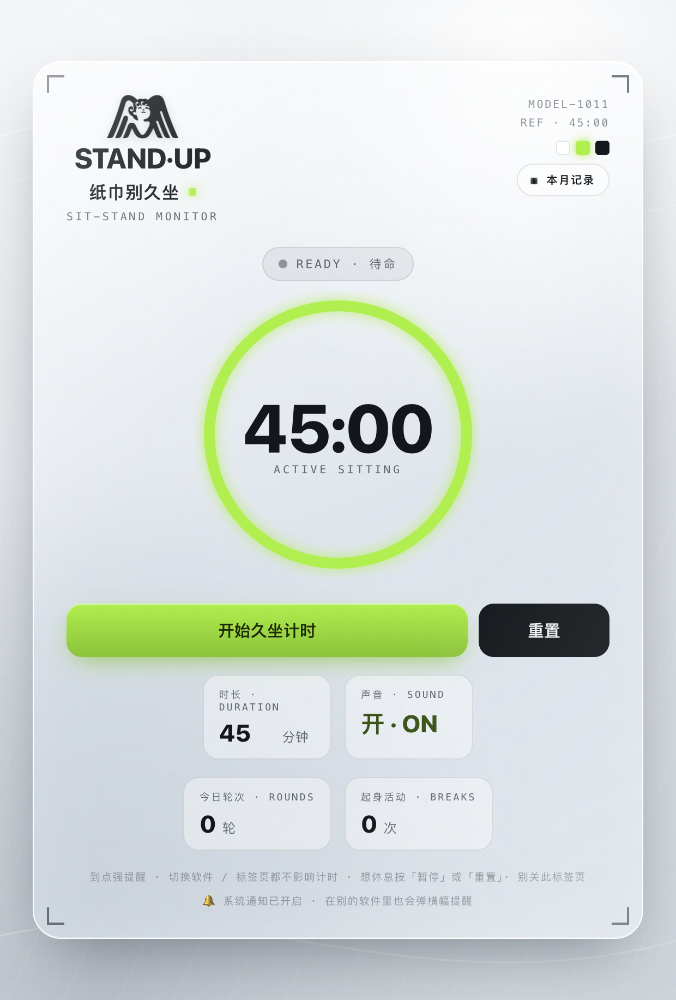
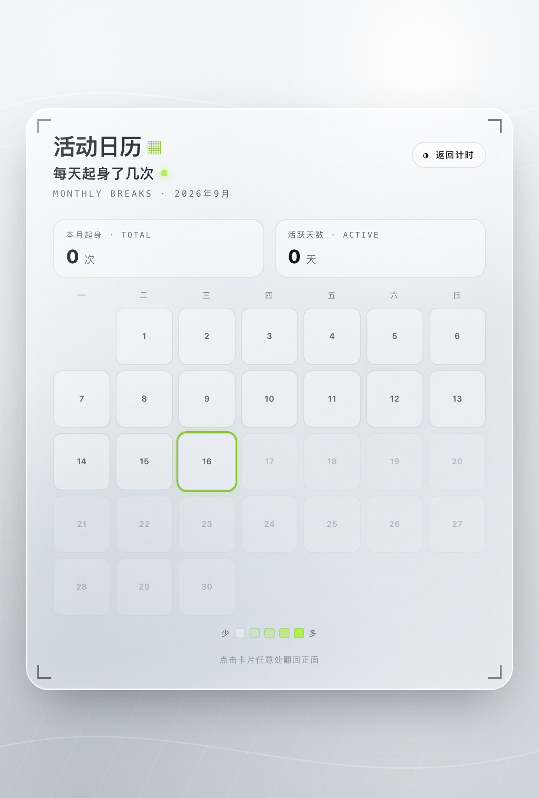

# 纸巾别久坐 · StandUp Reminder

一个会**强提醒你起身**的 macOS 久坐提醒小工具。坐满设定时长(默认 45 分钟)就全屏弹窗 + 声音 + 系统通知把你拽起来,然后强制 5 分钟活动,再开始下一轮。菜单栏常驻显示倒计时,窗口藏起来时几乎不耗电。

> 玻璃拟态(glassmorphism)HUD 界面,用 Electron 做成原生桌面 App,零前端框架。

<p align="center">
  
  &nbsp;&nbsp;
  
</p>

## ✨ 功能

- **久坐强提醒** —— 坐满 45 分钟(可调)自动全屏提醒起身:声音 + 系统通知 + 窗口**强制置顶抢到你眼前**(即使你正在别的全屏应用里)。
- **强制活动** —— 提醒后自动进入 5 分钟活动倒计时,熬完才能开始下一轮,防止"我知道了"然后继续坐。
- **菜单栏常驻** —— 顶部菜单栏实时显示剩余倒计时,不打开窗口也能瞄一眼。
- **智能催开始** —— 检测到你在用电脑却没开计时,过一会儿弹窗问要不要开始(递进式冷却,不唠叨)。
- **活动日历** —— 卡片可翻转,背面是本月每天起身次数的热力图。
- **随手改时间** —— 拖动倒计时圆环即可临时增减本轮时长。
- **低能耗** —— 窗口收进菜单栏时暂停一切渲染,CPU ≈ 0。

## 🚀 运行(开发模式)

先装 [Node.js](https://nodejs.org/)(建议 18+),然后:

```bash
npm install
npm start
```

## 📦 打包成 App

```bash
npm run dist
```

打包好的 `纸巾别久坐.app` 会出现在 `dist/` 里,拖进「应用程序」即可像普通软件一样用。

> ⚠️ 这是本地自行构建、**未做苹果签名**的 App。第一次打开若被 macOS 拦(提示"来自身份不明的开发者"),**右键点图标 →「打开」→ 再点「打开」**,只需这一次。

## 🖥 说明

- **目前仅适配 macOS** —— 菜单栏托盘、原生通知、强制抢焦点等逻辑都针对 macOS 调过。项目基于 Electron,理论上可移植到 Windows / Linux,但这部分交互需要另行适配。
- 技术栈:Electron + 原生 HTML / CSS / JS,界面在单个 `index.html` 里,主进程逻辑在 `main.js`。

## 📄 License

[MIT](./LICENSE) —— 随便用、随便改、随便分发。
